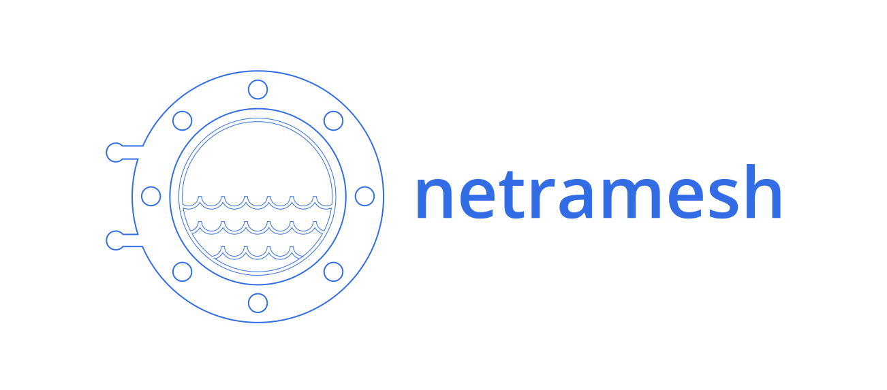

# NetraMesh

Service mesh NetraMesh includes:
- Transparent TCP proxy for microservices with original destination retrieval.
- Init container for network rules configuration (iptables based).

## Getting started

Check out [examples](./examples)

## Supported application level protocols
- HTTP/1.1 and lower

Also it supports any TCP proto traffic (proxies it transparently).

## HTTP proto

You can use `HTTP_HEADER_TAG_MAP` and `HTTP_COOKIE_TAG_MAP` for HTTP header to span tag conversion.

Example: `HTTP_HEADER_TAG_MAP=x-session:http.session,x-mobile-info:http.x-mobile-info`

## How it works

