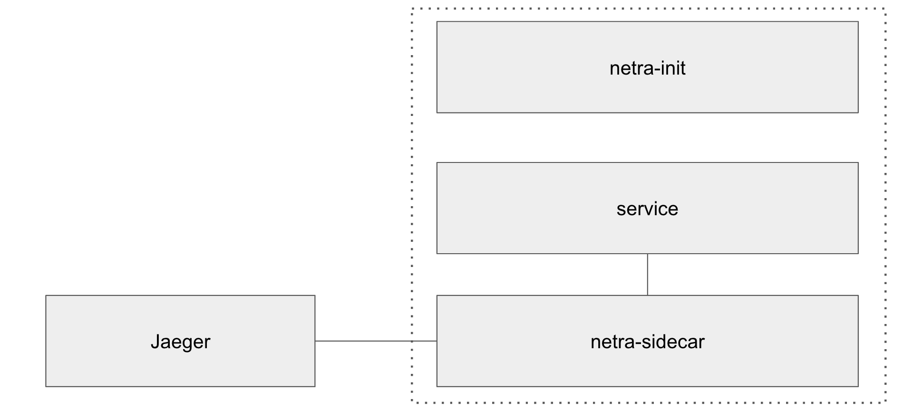
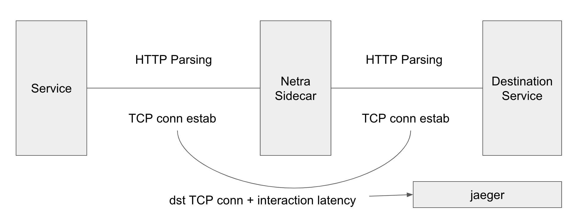

# netramesh

Ultra light service mesh has main goals:

- high performance
- observability (jaeger distributed tracing)
- simplicity of operation
- unlimited scalability
- any infrastructure compatibility
- transparency

Service mesh netramesh consists of two main parts:
- Transparent TCP proxy for microservices with original destination retrieval.
- Init container for network rules configuration (iptables based).

## Getting started

Check out [examples](./examples)

## Supported application level protocols
- HTTP/1.1 and lower

Also netra supports any TCP proto traffic (proxies it transparently).

## How it works

To intercept all TCP traffic netra uses [iptables redirect rules](./iptables-rules.sh). After applying them, TCP traffic goes firstly to netra sidecar. Netra sidecar determines original destination using SO_ORIGINAL_DST socket option. After that netra sidecar works in bidirectional stream processing mode and proxies all TCP packets through itself. If app level protocol is HTTP1, netra parses it and sends tracing span.

## Injecting

For now netra supports only manual injecting.

## Basic configuration (environment variables)

### Netra init (network interception settings)

Env name| Description
---|---
NETRA_SIDECAR_PORT | netra sidecar listen port redirect to (defaults to 14956)
NETRA_SIDECAR_USER_ID | netra sidecar user id to avoid infinite redirect loops (defaults to 1337)
NETRA_SIDECAR_GROUP_ID | netra sidecar group id to avoid infinite redirect loops (defaults to 1337)
INBOUND_INTERCEPT_PORTS | inbound ports to intercept (defaults to *, all ports)
OUTBOUND_INTERCEPT_PORTS | outbound ports to intercept (defaults to *, all ports)
NETRA_INBOUND_PROBABILITY | inbound probability to route TCP sessions (defaults to 1)
NETRA_OUTBOUND_PROBABILITY | outbound probability to route TCP sessions (defaults to 1)

### Netra sidecar

Switches

Switch name| Description
---|---
--service-name| service name for jaeger distributed trace spans

Env name| Description
---|---
NETRA_LOGGER_LEVEL | logger level (default info), supported values: debug, info, warning, error, fatal
NETRA_PORT | netra sidecar listen port (default 14956)
NETRA_PPROF_PORT | netra sidecar pprof port (default 14957)
NETRA_TRACING_CONTEXT_EXPIRATION_MILLISECONDS | tracing context mapping cache expiration (default 5000)
NETRA_TRACING_CONTEXT_CLEANUP_INTERVAL | tracing context cleanup interval (default 1000)
NETRA_HTTP_PORTS | comma separated ports to determine as HTTP1 protocol (no default)
HTTP_HEADER_TAG_MAP | comma separated HTTP header to jaeger span tag conversion (example: `x-session:http.session,x-mobile-info:http.x-mobile-info`)
HTTP_COOKIE_TAG_MAP | comma separated HTTP cookie value to span tag conversion (example: `sess:http.cookies.sess`)

Also it supports all env variables [jaeger go library](https://github.com/jaegertracing/jaeger-client-go#environment-variables) provides.

## Comparison with Istio and linkerd2

Why do we need one more service mesh solution? Istio and linkerd2 are perfect service mesh solutions with very powerful set of features. But unfortunately they add significant resource and performance overhead.
Netramesh main goal is providing observability to your distributed system with small overhead (approximately 10-50Mb on each netra sidecar) and 1ms of latency overhead. If you don't need entire set of features Istio and linkerd2 provide, but you need to collect distributed traces and obtain important information about your microservice interaction then netra is a great fit.
