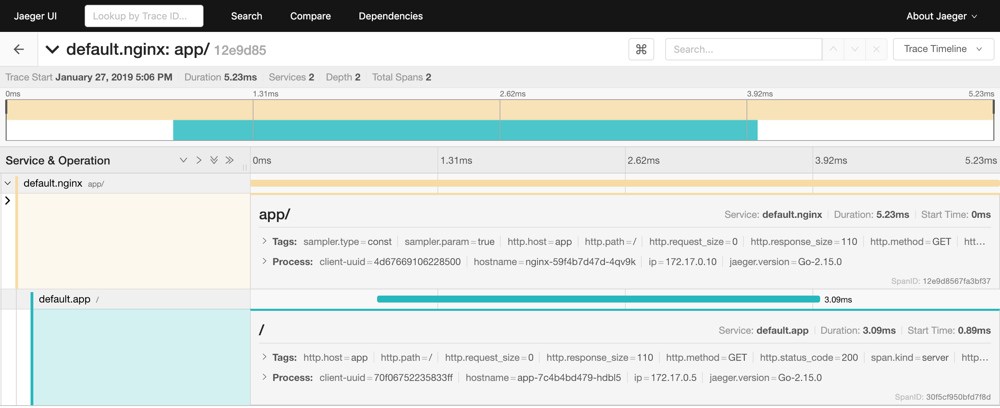

# Nginx + simple app with netra injected example

## Run on kubernetes cluster

If you want to run locally, you can use [minikube](https://kubernetes.io/docs/setup/minikube/)

Then with kubectl configured:

```bash
kubectl apply -R -f .
```

## Check everything is running

```bash
kubectl get po
NAME                                READY     STATUS    RESTARTS   AGE
app-7c4b4bd479-hdbl5                2/2       Running   0          1m
app-7c4b4bd479-hq59k                2/2       Running   0          1m
jaeger-deployment-cb746cb6c-wqp77   1/1       Running   0          1m
nginx-59f4b7d47d-4qv9k              2/2       Running   0          1m
```

## Send some requests

```bash
kubectl port-forward nginx-59f4b7d47d-4qv9k 8080:80

curl 127.0.0.1:8080/
curl 127.0.0.1:8080/
```

## Explore tracing information

Open jaeger-query.
If you use minikube, you can retrieve an address using command `minikube service jaeger-query --url`


